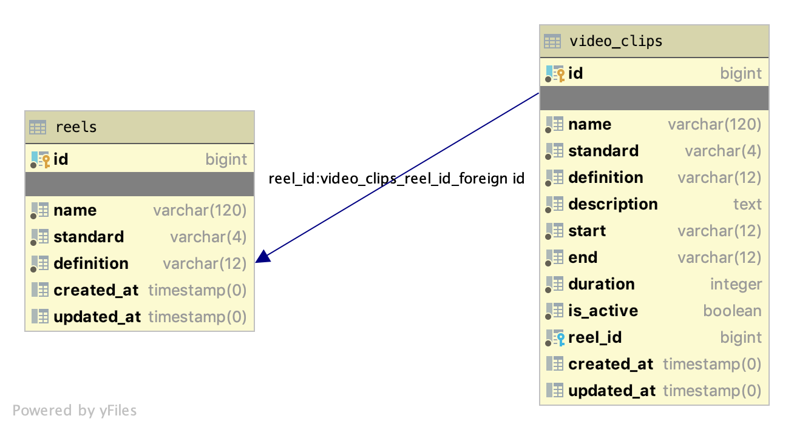

## How to run
### Build, run, stop
#### Prerequisite
1. `docker-compose version >= 1.25.4`

Open terminal & go to project root directory and execute the following command 

1. `make build` to build the project
2. `make start` to run the project
3. `curl` APIs
4. `make stop` to stop


## TODOs
 - Implement front end

## DB Schema

## API docs
### Create Reel
#### Request
```
curl -X POST http://localhost:8000/api/reels/ \
  -H 'Content-Type: application/json' \
  -d @- << EOF
  {
    "name": "sample 101",
    "video": {
      "name": "video sample 101",
      "standard": "NTSC",
      "definition": "HD",
      "description": "Description 101",
      "start": "00:00:29:05",
      "end": "00:01:20:00"
    }
  }
EOF
```
#### Response
```
{
  "code": 0,
  "message": "",
  "data": {
    "id": 69,
    "name": "sample 101",
    "duration": "00:00:50:25",
    "standard": "NTSC",
    "definition": "HD",
    "clip_videos": [
      {
        "id": 5,
        "name": "video sample 101",
        "duration": "00:00:50:25",
        "standard": "NTSC",
        "definition": "HD",
        "description": "Description 101",
        "start": "00:00:29:05",
        "end": "00:01:20:00"
      }
    ]
  }
}
```

### Add Video Clip
#### Request
```
curl -X POST http://localhost:8000/api/reels/69/videos \
  -H 'Content-Type: application/json' \
  -d @- << EOF
  {
    "name": "sample",
    "standard": "NTSC",
    "definition": "HD",
    "description": "Description 102",
    "start": "00:03:30:10",
    "end": "00:04:10:00"
  }
EOF
```
#### Response
```
{
  "code": 0,
  "message": "",
  "data": {
    "id": 6,
    "name": "sample",
    "duration": "00:00:39:20",
    "standard": "NTSC",
    "definition": "HD",
    "description": "Description 102",
    "start": "00:03:30:10",
    "end": "00:04:10:00"
  }
}
```
#### Request (incorrect input)
```
curl -X POST http://localhost:8000/api/reels/69/videos \
  -H 'Content-Type: application/json' \
  -d @- << EOF
  {
    "name": "sample",
    "standard": "NTSC",
    "definition": "SD",
    "description": "Description 103",
    "start": "00:03:30:10",
    "end": "00:04:10:00"
  }
EOF
```
#### Response
```
{
  "code": 3,
  "message": "Video defination must be HD",
  "data": null
}
```
### Delete Video Clip
#### Request
```
curl -X DELETE http://localhost:8000/api/reels/69/videos/6
```
#### Response
```
{
  "code": 0,
  "message": "deleted video",
  "data": {
    "id": 6
  }
}
```

### Get Reels
#### Request
```
curl -X GET http://localhost:8000/api/reels
```
#### Response
```
{
  "code": 0,
  "message": "",
  "data": [
    {
      "id": 67,
      "name": "sample",
      "duration": "01:01:01:02",
      "standard": "NTSC",
      "definition": "HD",
      "clip_videos": [
        {
          "id": 1,
          "name": "sample",
          "duration": "01:01:01:02",
          "standard": "NTSC",
          "definition": "HD",
          "description": "Description 1",
          "start": "01:23:49:27",
          "end": "02:24:50:29"
        }
      ]
    },
    {
      "id": 69,
      "name": "sample 101",
      "duration": "00:01:49:16",
      "standard": "NTSC",
      "definition": "HD",
      "clip_videos": [
        {
          "id": 5,
          "name": "video sample 101",
          "duration": "00:00:50:25",
          "standard": "NTSC",
          "definition": "HD",
          "description": "Description 101",
          "start": "00:00:29:05",
          "end": "00:01:20:00"
        },
        {
          "id": 7,
          "name": "sample",
          "duration": "00:00:58:21",
          "standard": "NTSC",
          "definition": "HD",
          "description": "Description 103",
          "start": "00:03:10:10",
          "end": "00:04:09:01"
        }
      ]
    }
  ]
}
```

### Get Reel
#### Request
```
curl -X GET http://localhost:8000/api/reels/69
```
#### Response
```
{
  "code": 0,
  "message": "",
  "data": {
    "id": 69,
    "name": "sample 101",
    "duration": "00:01:49:16",
    "standard": "NTSC",
    "definition": "HD",
    "clip_videos": [
      {
        "id": 5,
        "name": "video sample 101",
        "duration": "00:00:50:25",
        "standard": "NTSC",
        "definition": "HD",
        "description": "Description 101",
        "start": "00:00:29:05",
        "end": "00:01:20:00"
      },
      {
        "id": 7,
        "name": "sample",
        "duration": "00:00:58:21",
        "standard": "NTSC",
        "definition": "HD",
        "description": "Description 103",
        "start": "00:03:10:10",
        "end": "00:04:09:01"
      }
    ]
  }
}
```